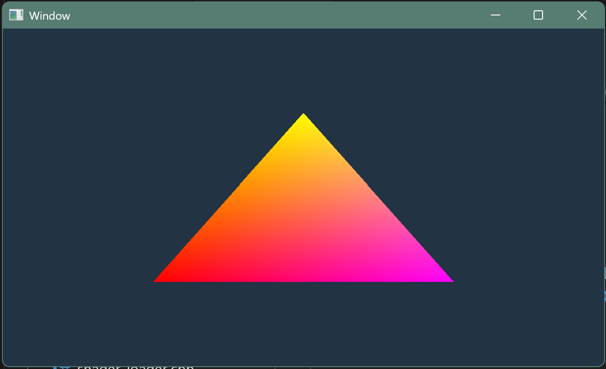
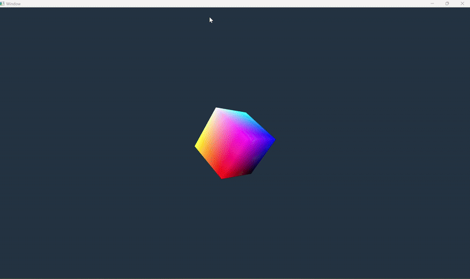
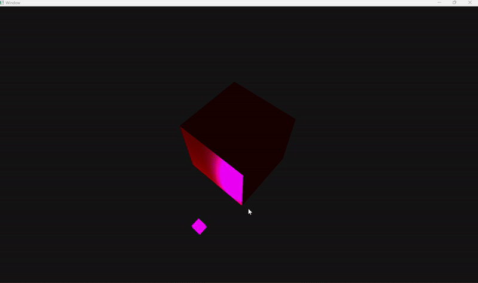

# Toy Render Engine: bgfx + GLFW
---

A minimal 3D rendering engine prototype built from scratch in C++ using bgfx and GLFW, designed to explore the core principles behind modern graphics pipelines, shader programming, and mathematical foundations of computer graphics.

This project serves as a personal learning environment to understand how 3D rendering works under the hood; from vertex transformations to lighting models; while maintaining a clean, modular, and OOP-oriented code structure.

---

## Project Overview

#### This project was developed to gain hands-on experience with:

- The 3D graphics pipeline and programmable shaders.

- Mathematical foundations of projections, normals, and lighting.

- Principles of engine architecture, including modular input and math systems.

- Clean code and separation of concerns in C++.

## Features Implemented
- Geometry & Transformations

- Rendered primitives: triangle → plane → cube → smooth f(x, y) → sphere.

- Implemented vertex shader transformations, including simple animations.

- Added grid rendering and camera navigation controls.

- Lighting System

- Implemented ambient, diffuse, and specular lighting models.

- Calculated surface normals using principles from differential geometry.

- Observed real-time visual effects of light on materials and geometry.

## Core Systems

- Minimal input system for camera and navigation.

- Basic math module (vectors, matrices, normals).

- Modular architecture designed for extensibility.

## What I Learned

- First-hand understanding of shader programming and the lighting pipeline.

- Application of linear algebra and differential geometry concepts in graphics.

- Importance of separation of concerns and clean OOP design in engine development.

- Practical experience building a C++ project using CMake and bgfx shader compiler.

#### Seeing mathematics come to life;  especially when the lighting kicked in for the first time;  made this project one of the most rewarding experiences I’ve had as a developer.

## Technologies & Tools

- Language: C++, GLSL

- Rendering Backend: bgfx

- Windowing/Input: GLFW

- Shader Compilation: bgfx shader compiler

- Build System: CMake

## Project Structure Overview

    ├── src/
    │   ├── main.cpp
    │   ├── shader/...
    │   ├── drawer/...
    │   ├── components/...
    │   └── input/...
    ├── shaders/
    │   ├── vertex/*.vert.sc
    │   ├── fragment/*.frag.sc
    │   ├── interface/varying.def.sc
    │   └── compiled/              # Auto-generated shader binaries
    ├── CMakeLists.txt
    └── .vscode/
        ├── tasks.json             # Build presets
        └── launch.json            # Debug

##  How to Build & Run

### Prerequisites
- **CMake ≥ 3.21**
- **MinGW (g++ 13.1 or newer)** — installed via Qt or standalone
- **Git** — required for FetchContent dependencies
- **VSCode** (recommended) with:
  - **CMake Tools** extension
  - **C++ Tools (cpptools)** extension for debugging

All dependencies (bgfx, bx, bimg, glfw, shaderc) are fetched automatically at configure time.

---

### Configure and Build (VSCode Workflow)

The repository includes a fully integrated build setup using `.vscode/tasks.json` and `.vscode/launch.json`.

#### To build and run:
1. Open the folder in **VSCode**.
2. Press **Ctrl + Shift + B** and select:

#### Build Debug (target only)

This will:
- Configure the CMake project (`mingw-debug` preset)
- Build the target **BGFX_project**
- Automatically compile all vertex and fragment shaders using **shaderc**

3. Press **F5** to start debugging with **gdb**  
(launches `${workspaceFolder}/build/debug/BGFX_project.exe`)

---

### Manual Command-Line Build (optional)

If you prefer building outside VSCode:

```bash
# Configure
cmake -B build/debug -G "MinGW Makefiles" -DCMAKE_BUILD_TYPE=Debug

# Build shaders + executable
cmake --build build/debug
```

Shader binaries are generated automatically at:
``` shaders/compiled/```

and included in the runtime via ```SHADER_BIN_DIR```.

#### To run the app manually:

```bash ./build/debug/BGFX_project.exe ```


### Notes

- The build system automatically detects shader files and recompiles them when modified.

- The output path for precompiled shaders is passed at compile time as: ```SHADER_BIN_DIR = "shaders/compiled"```


- Tested on Windows 11 (MinGW + bgfx + GLFW).
Linux builds are supported with minimal modification (change platform to linux in CMake).

## Controls & Navigation 
### Overview

- yaw (horizontal rotation)

- pitch (vertical rotation)

- dist (distance from the target)

- target (the point the camera orbits around)

The camera always orbits around this target point, like Blender’s viewport navigation.

### Controls
#### Input	Action	Description
- **Middle Mouse:**  *Drag	Orbit* -	Rotates the camera around the target, Horizontal motion changes yaw, vertical motion changes pitch.
- **Shift + Middle Mouse Drag:** *Pan* -	Moves the target point parallel to the screen, effectively translating the camera and target together.
- **Scroll Wheel:**	*Zoom* -	Moves the camera closer or farther from the target (dolly in/out).

### Internals (How Each Mode Works)

- Horizontal drag changes yaw → rotates around the vertical (Y) axis.

- Vertical drag changes pitch → rotates up/down around the right (X) axis.

Both are scaled by rotateSpeed (radians per pixel).

- The pitch is clamped so you can’t flip upside down ($\pm \frac{\pi}{2}$ limit).

**Effect:** The camera orbits the target on a sphere of radius dist.

- The code computes right and camUp vectors from the camera’s current orientation.

- It moves the target along those vectors, so dragging feels “screen-aligned.”

- The pan speed scales with distance (dist), so panning feels consistent regardless of zoom level.

**Effect:** The scene slides left/right/up/down without changing the orbit angle.

- Each wheel tick changes distance exponentially, not linearly — giving a smooth dolly effect.

- The distance is clamped between minDist and maxDist to avoid clipping or inversion.

**Effect:** Zooms smoothly toward or away from the target, just like in professional 3D editors.


### Summary

Imagine your camera is attached to the end of a boom arm that always points toward a “target.”

- Orbiting rotates that arm around the target.

- Panning slides both arm and target sideways.

- Zooming extends or retracts the arm length.
This makes navigation intuitive and physically consistent.

## Future Plans

- Load 3D assets from external tools (e.g., Blender via FBX/OBJ).

- Improve lighting with physically based rendering or ray tracing.

- Implement physics simulation for dynamic scenes.

- Design a more robust UI/IO system for debugging and configuration.

## Professional Qualities

- Modular, extensible, and object-oriented design.

- Clear boundaries between rendering, input, and math systems.

- Built with maintainability and scalability in mind.
## Gallery
### Display window & Triangle rendering & Basic fragment shader

### Cube rendering & Time based transformations

### Navigation & Axis grid

### Lights: Ambient + Diffuse + Specular

### Lights & Math driven vertex transformations


---

### Built with C++, mathematics, and curiosity.